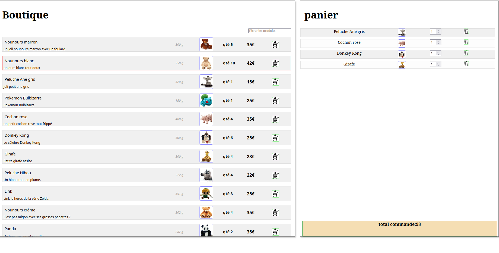

# Boutique Angular

Ce projet est une boutique en ligne développée avec **Angular**. Il permet de parcourir des Nounours , les ajouter au panier.


## Cloner le projet

Pour récupérer le projet, utilisez la commande suivante :

```sh
git clone https://github.com/Zenaidji/Boutique-Angular.git
```

## Installation des dépendances

Avant de lancer l'application, installez les dépendances nécessaires avec **npm** :

```sh
npm install
```

## Lancer l'application

Démarrez le serveur de développement avec :

```sh
npm start
```

Puis, ouvrez votre navigateur et accédez à :

```
http://localhost:4200
```

## Prérequis

Avant d'installer et d'exécuter le projet, assurez-vous d'avoir les éléments suivants installés sur votre machine :

- **Node.js** (version recommandée : 16+)
- **npm** (installé avec Node.js)
- **Angular CLI** (à installer globalement si ce n'est pas déjà fait) :

```sh
npm install -g @angular/cli
```
